+++
title = "Generalised Swath Profile Tutorial"
date = 2026-02-08T17:30:00-05:00
summary = "Notebook-style tutorial introducing transverse and longitudinal swath profiles in TopoToolbox, with river integration and practical parameter choices."
tags = ["tutorial", "topotoolbox", "swath-profile", "geomorphology", "python"]
draft = false
notebook = true
+++

## Generalised swath profile

Coming soon in `pytopotoolbox` v. 0.08 and `libtopotoolbox` (probably to the MATLAB and R versions if there is demand), I implemented a swath engine—useful for visualisation, quick analysis, or more detailed ones.

Swath profile allows the analysis of areas neighbouring a baseline. It can be useful for following relief evolution — or any other raster-like metrics in space around a given line. 

I present here two kinds of swath profiles:

- Transverse swaths: think cross-section — how does my metric evolve on one side or the other of my line overall. e.g. how steeper is my drainage divide on the Northern side.
- Longitudinal swaths: think spatial evolution — how does my metric evolve along my baseline. e.g. how relief increases as my river decreases.

Both share the same base method to define which points are to be considered, based on [Hergarten et al., 2014](https://esurf.copernicus.org/articles/2/97/2014/esurf-2-97-2014.pdf). **The key principle is that every pixel within the distance mask is associated to one single swath points** (although I provide binning distances to associate multiple points together).

## In this tutorial:

1) We do a basic “rectilinear” large swath over Taiwan to introduce the basics about the transverse and longitudinal swath
2) In a second part, we demonstrate the integration with `pytopotoolbox` to proceed to an effortless swath along the river
3) We show some method to deal with baseline simplification, to make cleaner swath if they are too meandering
4) Finally, if the one-point = one track constrained is too restrictive I added a fallback method that does a simple windowed swath (rectangular window oriented by linear regressions around the track) 

<div class="alert alert-warning" style="color:blue;" >
  <strong>NOTE:</strong> If you are on MATLAB topotoolbox and focusing on rivers or drainage divide, I recommend the excellent <a href=https://github.com/BMathieux/TRANSECT target="_blank">TRANSECT</a> from Bastien Mathieux! It's a lot more detailed than this tool that's more designed for generic swath  analysis.
</div>

Prerequisite: `pip install topotoolbox ipympl jupyterlab` (`ipympl` is optional but it allows the nice embedded matplotlib widget inside jupyter)

## 1. Rectilinear Swath


#### Imports and loading DEM

We'll start by simply importaing the packages and loading a test demo—why not Taiwan?

I'll plot it nicely too.


```python
import topotoolbox as ttb
import matplotlib.pyplot as plt
import numpy as np
%matplotlib widget

# Just deactivating a warning
plt.rcParams['figure.max_open_warning'] = 50 

dem = ttb.load_dem('taiwan')


fig,ax = plt.subplots(figsize = (6,8))
im = ax.imshow(dem.z, extent = dem.extent, cmap = 'terrain')
ax.imshow(dem.hillshade(), extent = dem.extent, cmap = 'gray', alpha = 0.6)
ax.grid(ls='--',alpha=0.5)
ax.set_xlabel('Easting (m)')
ax.set_ylabel('Northing (m)')
plt.colorbar(im, label = 'elevation (m)')


```


    <matplotlib.colorbar.Colorbar at 0x7f63e315db10>


<div style="display: inline-block;">
    <div class="jupyter-widgets widget-label" style="text-align: center;">
        Figure
    </div>
    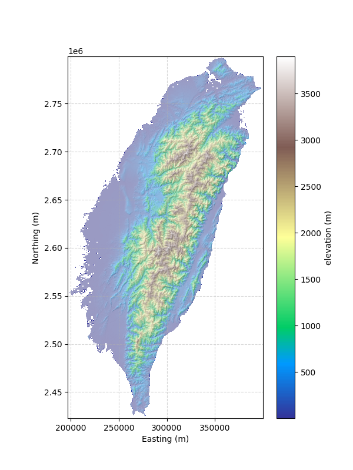
</div>


## Straight line(s)

Let's start with "straight" line or multi-lines for global overall swaths, useful, for example, for large scale swaths.


#### Baseline helper

`pytopotoolbox` provide a helper to create lines from points (using [Bresenham's line algorithm](https://en.wikipedia.org/wiki/Bresenham%27s_line_algorithm)): `sampled_x, sampled_y = ttb.sample_points_between_refs(dem, ref_x, ref_y, input_mode="coordinates")`

<div class="alert alert-warning" style="color:blue;" >
  <strong>NOTE:</strong> ref_x and ref_y can be "coordinates" (X,Y on map), "indices2D" so row/columns, or just track_x as flat node indices with "indices1D". For specific needs, use_d4=True can force a D4 topology (no diagonal skips).
</div>


```python
ref_x = [2.623e5,  3.038e5, 3.197e5, 3.790e5]
ref_y = [2.4761e6, 2.6130e6, 2.7016e6, 2.7632e6]
sampled_x, sampled_y = ttb.sample_points_between_refs(dem, ref_x, ref_y, input_mode="coordinates")

fig,ax = plt.subplots(figsize = (6,8))
im = ax.imshow(dem.z, extent = dem.extent, cmap = 'terrain')
ax.imshow(dem.hillshade(), extent = dem.extent, cmap = 'gray', alpha = 0.6)
ax.grid(ls='--',alpha=0.5)
ax.set_xlabel('Easting (m)')
ax.set_ylabel('Northing (m)')
ax.scatter(sampled_x, sampled_y, lw =0, s=3, color = 'k')
ax.scatter(ref_x, ref_y, lw =1, s=50, marker = 'X', facecolor = 'r',edgecolor = 'k')
plt.colorbar(im, label = 'elevation (m)')
```


    <matplotlib.colorbar.Colorbar at 0x7f65801bbbd0>


<div style="display: inline-block;">
    <div class="jupyter-widgets widget-label" style="text-align: center;">
        Figure
    </div>
    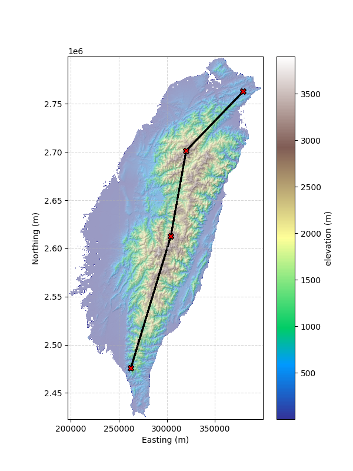
</div>


#### Distance map and halfwidth

The backbone of all the swaths is the distance map, which is then used to associate each pixel to a bin for the transverse swath statistics, or a profile point for the longitudinal swaths.

So first step is to calculate this map for a given **half width** from the profile (in map units) - here we will use 20 km. Note that I use the continuous line sampled with all the points - otherwise it will not work.

<div class="alert alert-warning" style="color:red;" >
  <strong>WARNING:</strong> the map is by default signed (positive and negative values), this is crucial for the swath which needs to know which "side" of the line a pixel is located.
</div>


```python
half_width = 20000 # metres
distance_map = ttb.compute_swath_distance_map(dem, sampled_x, sampled_y, half_width=half_width, input_mode="coordinates")

fig,ax = plt.subplots(figsize = (6,8))
im = ax.imshow(dem.z, extent = dem.extent, cmap = 'terrain')
ax.imshow(dem.hillshade(), extent = dem.extent, cmap = 'gray', alpha = 0.45)
ax.imshow(np.abs(distance_map.z), extent = dem.extent, cmap = 'magma', alpha = 0.8)
ax.grid(ls='--',alpha=0.5)
ax.set_xlabel('Easting (m)')
ax.set_ylabel('Northing (m)')
ax.scatter(sampled_x, sampled_y, lw =0, s=3, color = 'k')
ax.scatter(ref_x, ref_y, lw =1, s=50, marker = 'X', facecolor = 'r',edgecolor = 'k')
plt.colorbar(im, label = 'elevation (m)')
```


    <matplotlib.colorbar.Colorbar at 0x7f63da2b6590>


<div style="display: inline-block;">
    <div class="jupyter-widgets widget-label" style="text-align: center;">
        Figure
    </div>
    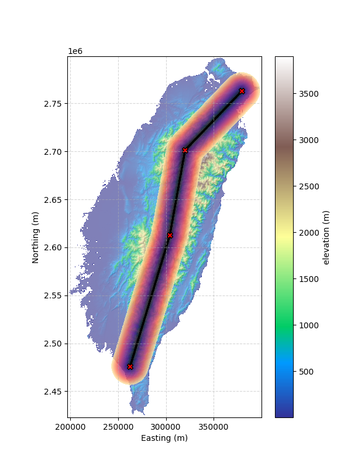
</div>


#### Transverse Swaths

Transverse swath bin the full swath by **distance from the profile** and reports statistics as cross sections. Note that this version of the swath does not need the profile points anymore.

It returns a small small object wrapping hte results and helping with the plotting.

Available output: 

- distances
- means
- stddevs
- mins
- maxs
- counts
- medians
- q1
- q3
- percentiles


```python
t_swath = ttb.transverse_swath(dem, distance_map, half_width, bin_resolution = 500, percentiles=[5,10,20,80,90,95])

fig,ax = plt.subplots()
# distances is the distance transversal to the swath
ax.fill_between(t_swath.distances, t_swath.percentiles[5], t_swath.percentiles[95], lw = 0, color = 'k', alpha = 0.3)
ax.fill_between(t_swath.distances, t_swath.q1, t_swath.q3, lw = 0, color = 'k', alpha = 0.3)
ax.plot(t_swath.distances, t_swath.medians, lw = 2, color = 'k')

ax.grid(ls='--', alpha = 0.5)
ax.set_xlabel('Distance from profile (m)')
ax.set_ylabel('Elevation (m)')
```


    Text(0, 0.5, 'Elevation (m)')


<div style="display: inline-block;">
    <div class="jupyter-widgets widget-label" style="text-align: center;">
        Figure
    </div>
    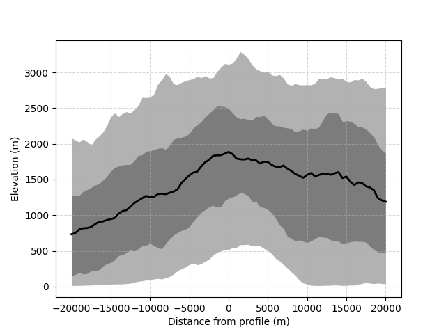
</div>


#### Longitudinal Swaths

Longitudinal swath draw the swath by **distance along the profile** and reports statistics in the vicinity of the profile.

**Important choices: `binning_distance` and `exclude_extended_bin`:**

- `binning_distance=0`: the swath draws perpendicular lines to each points and gather stats along this line.
- `binning_distance>0`: Windowed stats lumping points within binning distance along the profile.
- `n_points_regression=X`: if binning distance is 0, then it does a linear regression over n points around each POI to define the orthogonal to the profile.

It returns a small object wrapping the results and helping with the plotting.

Available outputs:

- means
- stddevs
- mins
- maxs
- counts
- medians
- q1
- q3
- percentiles
- along_track_distances

<div class="alert alert-warning" style="color:red;" >
  <strong>WARNING:</strong> This version is more computationally expensive, and it increases with binning_distance and n_points_regression.
</div>


```python
binning_distance = 1000
l_swath_0 = ttb.longitudinal_swath(dem, sampled_x, sampled_y, distance_map, half_width, binning_distance = binning_distance, n_points_regression = 10, percentiles=[5,10,20,80,90,95], input_mode = "coordinates")
```


```python
fig,ax = plt.subplots()
# distances is the distance transversal to the swath
ax.fill_between(l_swath_0.along_track_distances, l_swath_0.percentiles[5], l_swath_0.percentiles[95], lw = 0, color = 'k', alpha = 0.3)
ax.fill_between(l_swath_0.along_track_distances, l_swath_0.q1, l_swath_0.q3, lw = 0, color = 'k', alpha = 0.3)
ax.plot(l_swath_0.along_track_distances, l_swath_0.medians, lw = 2, color = 'k')

ax.grid(ls='--', alpha = 0.5)
ax.set_xlabel('Distance along profile (m)')
ax.set_ylabel('Elevation (m)')
```


    Text(0, 0.5, 'Elevation (m)')


<div style="display: inline-block;">
    <div class="jupyter-widgets widget-label" style="text-align: center;">
        Figure
    </div>
    
</div>


You can locate and check which points are associated with each profile using `get_point_pixels`. Here for point # 5000 along the profile.

**This is particularly useful to tweak the parameters**


```python
x_points, y_points = ttb.get_point_pixels(dem, sampled_x, sampled_y, distance_map, 1000, half_width, binning_distance = binning_distance, n_points_regression = 10, input_mode = "coordinates")
fig,ax = plt.subplots(figsize = (6,8))
im = ax.imshow(dem.z, extent = dem.extent, cmap = 'terrain')
ax.imshow(dem.hillshade(), extent = dem.extent, cmap = 'gray', alpha = 0.6)
ax.grid(ls='--',alpha=0.5)
ax.set_xlabel('Easting (m)')
ax.set_ylabel('Northing (m)')
ax.scatter(sampled_x, sampled_y, lw =0, s=3, color = 'k')
ax.imshow(np.abs(distance_map.z), extent = dem.extent, cmap = 'magma', alpha = 0.8)

ax.scatter(x_points, y_points, color = 'cyan', lw = 0, s =5)
plt.colorbar(im, label = 'elevation (m)')
```


    <matplotlib.colorbar.Colorbar at 0x7f63d5803bd0>


<div style="display: inline-block;">
    <div class="jupyter-widgets widget-label" style="text-align: center;">
        Figure
    </div>
    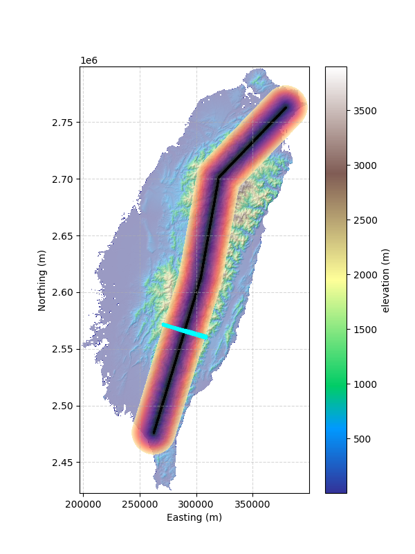
</div>


## 2. Full example case: swath along a river

Let's first selcet the longuest river of a basin (I won't detail the process, see ttb doc).


```python
dem = ttb.load_dem('bigtujunga')
flow = ttb.FlowObject(dem)
stream = ttb.StreamObject(flow, units = 'pixels', threshold=100)
stream = stream.klargestconncomps()
stream = stream.trunk()
xriv,yriv = nodes = ttb.transform_coords(dem, stream.source_indices[0], stream.source_indices[1], input_mode="indices2D", output_mode="coordinates")

fig,ax = plt.subplots(figsize = (10,5))
im = ax.imshow(dem.z, extent = dem.extent, cmap = 'terrain')
ax.imshow(dem.hillshade(), extent = dem.extent, cmap = 'gray', alpha = 0.6)
ax.grid(ls='--',alpha=0.5)
ax.scatter(xriv,yriv, c='red', s=1, lw=0, label='River Trunk')
ax.set_xlabel('Easting (m)')
ax.set_ylabel('Northing (m)')
plt.colorbar(im, label = 'elevation (m)')
```


    <matplotlib.colorbar.Colorbar at 0x7f63d587bd90>


<div style="display: inline-block;">
    <div class="jupyter-widgets widget-label" style="text-align: center;">
        Figure
    </div>
    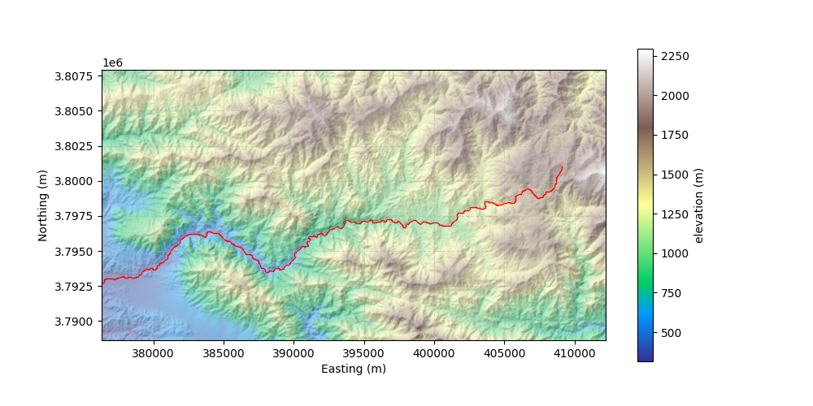
</div>


 Let's compute the distance map using the main stream's coordinates


```python
half_width = 2500 # metres
distance_map = ttb.compute_swath_distance_map(dem, xriv, yriv, half_width=half_width, input_mode="coordinates")
fig,ax = plt.subplots(figsize = (8,5))
im = ax.imshow(dem.z, extent = dem.extent, cmap = 'terrain')
ax.imshow(dem.hillshade(), extent = dem.extent, cmap = 'gray', alpha = 0.45)
ax.imshow(np.abs(distance_map.z), extent = dem.extent, cmap = 'magma', alpha = 0.8)
ax.grid(ls='--',alpha=0.5)
ax.set_xlabel('Easting (m)')
ax.set_ylabel('Northing (m)')
ax.scatter(xriv,yriv, c='red', s=1, lw=0, label='River Trunk')

plt.colorbar(im, label = 'elevation (m)',fraction=0.03, pad=0.02)
```


    <matplotlib.colorbar.Colorbar at 0x7f63e0d53890>


<div style="display: inline-block;">
    <div class="jupyter-widgets widget-label" style="text-align: center;">
        Figure
    </div>
    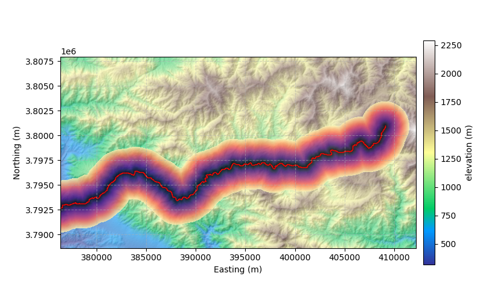
</div>


As simple as that! we have a nice distance map, we can now compute the swath


```python
binning_distance = 1000
l_swath_0 = ttb.longitudinal_swath(dem, xriv, yriv, distance_map, half_width, binning_distance = binning_distance, n_points_regression = 20, percentiles=[5,10,20,80,90,95], input_mode = "coordinates")

fig,ax = plt.subplots()
# distances is the distance transversal to the swath
ax.fill_between(l_swath_0.along_track_distances, l_swath_0.percentiles[5], l_swath_0.percentiles[95], lw = 0, color = 'k', alpha = 0.3)
ax.fill_between(l_swath_0.along_track_distances, l_swath_0.q1, l_swath_0.q3, lw = 0, color = 'k', alpha = 0.3)
ax.plot(l_swath_0.along_track_distances, l_swath_0.medians, lw = 2, color = 'k')

ax.grid(ls='--', alpha = 0.5)
ax.set_xlabel('Distance along profile (m)')
ax.set_ylabel('Elevation (m)')
```


    Text(0, 0.5, 'Elevation (m)')


<div style="display: inline-block;">
    <div class="jupyter-widgets widget-label" style="text-align: center;">
        Figure
    </div>
    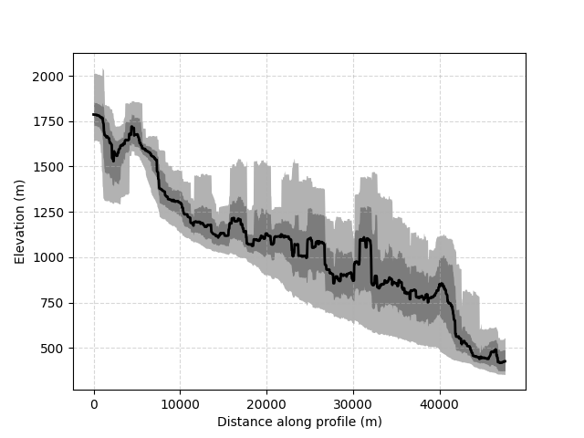
</div>


**Once again it is important to check a few points.pixel correspondance, in case the swath is not representing what we need**


```python
x_points, y_points = ttb.get_point_pixels(dem, xriv, yriv, distance_map, 500, half_width, binning_distance = 1000, n_points_regression = 100, input_mode = "coordinates")
fig,ax = plt.subplots(figsize = (8,6))
im = ax.imshow(dem.z, extent = dem.extent, cmap = 'terrain')
ax.imshow(dem.hillshade(), extent = dem.extent, cmap = 'gray', alpha = 0.6)
ax.grid(ls='--',alpha=0.5)
ax.set_xlabel('Easting (m)')
ax.set_ylabel('Northing (m)')
ax.scatter(x_points, y_points, color = 'cyan', lw = 0, s =5)
ax.plot(xriv, yriv, lw =1, color = 'k')
ax.imshow(np.abs(distance_map.z), extent = dem.extent, cmap = 'magma', alpha = 0.8)

plt.colorbar(im, label = 'elevation (m)')
```


    <matplotlib.colorbar.Colorbar at 0x7f63e0cf3bd0>


<div style="display: inline-block;">
    <div class="jupyter-widgets widget-label" style="text-align: center;">
        Figure
    </div>
    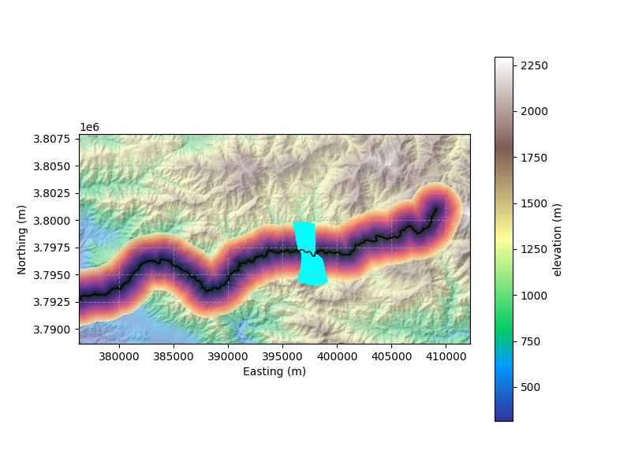
</div>


## 3. My point sampling is not optimal, what are my options?

I made the arbitrary choice to follow a distance-based swath method as described in Hergarten et al., 2014 (or at least how I understood and adapted it). The main implication is that each and every point in the distance mask is only associated with one point on the track.

This has implications for the longitudinal swath: if the binning distance is small:


```python
x_points, y_points = ttb.get_point_pixels(dem, xriv, yriv, distance_map, 500, half_width, binning_distance = 100, n_points_regression = 100, input_mode = "coordinates")
fig,ax = plt.subplots(figsize = (8,6))
im = ax.imshow(dem.z, extent = dem.extent, cmap = 'terrain')
ax.imshow(dem.hillshade(), extent = dem.extent, cmap = 'gray', alpha = 0.6)
ax.grid(ls='--',alpha=0.5)
ax.set_xlabel('Easting (m)')
ax.set_ylabel('Northing (m)')
ax.scatter(x_points, y_points, color = 'cyan', lw = 0, s =5)
ax.plot(xriv, yriv, lw =1, color = 'k')
ax.imshow(np.abs(distance_map.z), extent = dem.extent, cmap = 'magma', alpha = 0.8)
ax.set_title("Example of non-optimal sampling")
plt.colorbar(im, label = 'elevation (m)')
```


    <matplotlib.colorbar.Colorbar at 0x7f63e097db10>


<div style="display: inline-block;">
    <div class="jupyter-widgets widget-label" style="text-align: center;">
        Figure
    </div>
    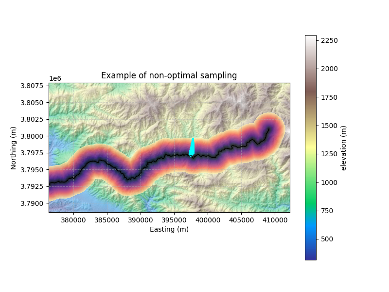
</div>


#### What is happening? 

With only 100m of binning, that's like 4 pixels on the profile. At this selected location, it is bended, so the concave side of the bend is only connected to a few nodes. Further away, the nodes are connected to other parts of the profile.

#### Solution? Recomputing a simplified centre-line

I was ready to push the update when I notice this pitfall could actually be frequent. So I coded an extra function that **reconstruct a centre-line by creating a distance map from the outter bond of the mask**


```python
half_width = 2500 # metres
Dmap = ttb.compute_swath_distance_map(dem, xriv, yriv, half_width=half_width, input_mode="coordinates", return_centre_line=True)


fig,(ax,ax2) = plt.subplots(1,2,figsize = (12,5))
im = ax.imshow(dem.z, extent = dem.extent, cmap = 'terrain')
ax.imshow(dem.hillshade(), extent = dem.extent, cmap = 'gray', alpha = 0.45)
ax.imshow(np.abs(Dmap.distance_map.z), extent = dem.extent, cmap = 'magma', alpha = 0.8)
ax.grid(ls='--',alpha=0.5)
ax.set_xlabel('Easting (m)')
ax.set_ylabel('Northing (m)')
ax.scatter(xriv,yriv, c='red', s=1, lw=0, label='River Trunk')
ax.set_title("Original baseline")
plt.colorbar(im, label = 'elevation (m)',fraction=0.03, pad=0.02)

ax=ax2
im = ax.imshow(dem.z, extent = dem.extent, cmap = 'terrain')
ax.imshow(dem.hillshade(), extent = dem.extent, cmap = 'gray', alpha = 0.45)
ax.imshow(np.abs(Dmap.dist_from_boundary), extent = dem.extent, cmap = 'magma', alpha = 0.8)
ax.grid(ls='--',alpha=0.5)
ax.set_xlabel('Easting (m)')
ax.set_ylabel('Northing (m)')
ax.scatter(Dmap.centre_line_x,Dmap.centre_line_y, c='red', s=1, lw=0, label='River Trunk')
ax.set_title("Centreline line")
plt.colorbar(im, label = 'elevation (m)',fraction=0.03, pad=0.02)

plt.tight_layout()
```


<div style="display: inline-block;">
    <div class="jupyter-widgets widget-label" style="text-align: center;">
        Figure
    </div>
    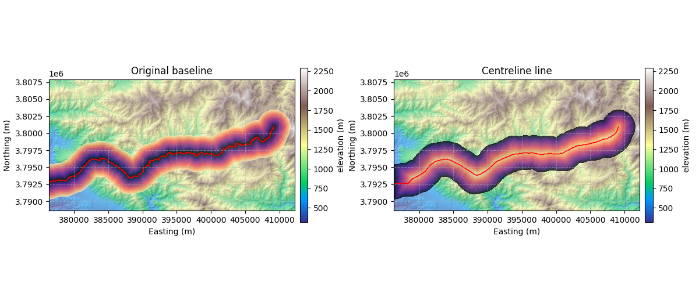
</div>


_**Et voilà**_, now we can rerun the full stack and it will behave better in most places.
<div class="alert alert-warning" style="color:red;" >
  <strong>WARNING:</strong> The distance map dist_from_boundary cannot be used for swath processing (it provides info for width stuff), we need to recalculate a distance map.
</div>
<div class="alert alert-warning" style="color:red;" >
  <strong>WARNING II:</strong> This method of "one pixel is associated to only one track point" has some flaws: Any bend with small window size will undersample the concave side. If this is an issue, switch to part 4 of this tuto.  
</div>


```python
half_width = 2500 # metres
distance_map = ttb.compute_swath_distance_map(dem, Dmap.centre_line_x, Dmap.centre_line_y, half_width=half_width, input_mode="coordinates")
```


```python
x_points, y_points = ttb.get_point_pixels(dem, Dmap.centre_line_x,Dmap.centre_line_y, distance_map, 250, half_width, binning_distance = 1000, n_points_regression = 100, input_mode = "coordinates")
fig,ax = plt.subplots(figsize = (8,5))
im = ax.imshow(dem.z, extent = dem.extent, cmap = 'terrain')
ax.imshow(dem.hillshade(), extent = dem.extent, cmap = 'gray', alpha = 0.6)
ax.grid(ls='--',alpha=0.5)
ax.set_xlabel('Easting (m)')
ax.set_ylabel('Northing (m)')
ax.scatter(x_points, y_points, color = 'cyan', lw = 0, s =5)
ax.plot(Dmap.centre_line_x,Dmap.centre_line_y, lw =1, color = 'k')
ax.imshow(np.abs(distance_map.z), extent = dem.extent, cmap = 'magma', alpha = 0.8)
ax.set_title("Example of non-optimal sampling")
plt.colorbar(im, label = 'elevation (m)')
```


    <matplotlib.colorbar.Colorbar at 0x7f63e08c2c50>


<div style="display: inline-block;">
    <div class="jupyter-widgets widget-label" style="text-align: center;">
        Figure
    </div>
    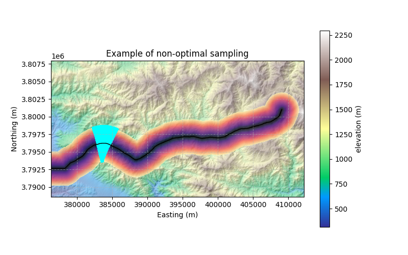
</div>


### Line simplification via Iterative End-Point Fit

Another way to simplify our baseline is to use graphical algorithm like the Iterative End-Point Fit. the latter simply draw a line between the starting and ending points and divide the profile into N segments. this function return the break points and you can use `sample_points_between_refs` to create a new baseline.

Here is the specs:

Simplify a polyline using the Iterative End-Point Fit (IEF) engine.
```
Parameters:

grid : GridObject
    Reference grid.
track_x, track_y : array-like
    Track coordinates or indices.
tolerance : float
    Meaning depends on method:
    - method 0 (FIXED_N): exact number of output points (clamped to [2, n_points]).
    - method 1 (KNEEDLE): ignored (automatic knee detection).
    - method 2 (AIC): RMSE noise floor (coordinate units). Larger tolerance -> fewer points.
    - method 3 (BIC): RMSE noise floor (same as AIC).
    - method 4 (MDL): RMSE noise floor (same as AIC).
    - method 5 (VW_AREA): triangle area threshold (coordinate units squared).
    - method 6 (L_METHOD): ignored (L-method elbow detection).
method : int
    Simplification method:
    - 0: FIXED_N
    - 1: KNEEDLE
    - 2: AIC
    - 3: BIC
    - 4: MDL
    - 5: VW_AREA
    - 6: L_METHOD
input_mode : str
    "indices2D", "indices1D" or "coordinates".
```


```python
sx,sy = ttb.simplify_line(dem, xriv,yriv, tolerance = 10, method = 3, input_mode= "coordinates")
fig,ax = plt.subplots()

ax.plot(xriv,yriv)
ax.plot(sx,sy)
```


    [<matplotlib.lines.Line2D at 0x7f63e0705410>]


<div style="display: inline-block;">
    <div class="jupyter-widgets widget-label" style="text-align: center;">
        Figure
    </div>
    
</div>


## 4. Window swath for brute force systematicity

First, I am not 200% sure "systematicity" is a word, but I like it, so I'll keep it. 

If under-sampling the bend is an issue or if you really need small bins, the alternative is to do simple rectangular swaths for each point. We simply gather N points per bins, proceed to a linear regression through these points, and then an orthogonal projection defnes a bounding rectangle in which we gather pixels. Easy, prone to oversampling, but consistent in the number of points represented by track points. Syntax is very similar - though no distance map involved anymore.


```python
binning_distance = 1000
l_swath_w = ttb.longitudinal_swath_windowed(dem, Dmap.centre_line_x,Dmap.centre_line_y, half_width, binning_distance = binning_distance, n_points_regression = 10, percentiles=[5,10,20,80,90,95], input_mode = "coordinates")
l_swath_0 = ttb.longitudinal_swath(dem, Dmap.centre_line_x,Dmap.centre_line_y,distance_map, half_width, binning_distance = binning_distance, n_points_regression = 10, percentiles=[5,10,20,80,90,95], input_mode = "coordinates")
```


```python
fig,ax = plt.subplots()
# distances is the distance transversal to the swath
ax.fill_between(l_swath_w.along_track_distances, l_swath_w.percentiles[5], l_swath_w.percentiles[95], lw = 0, color = 'k', alpha = 0.3)
ax.fill_between(l_swath_w.along_track_distances, l_swath_w.q1, l_swath_w.q3, lw = 0, color = 'k', alpha = 0.3)
ax.plot(l_swath_w.along_track_distances, l_swath_w.medians, lw = 2, color = 'k')

ax.grid(ls='--', alpha = 0.5)
ax.set_xlabel('Distance along profile (m)')
ax.set_ylabel('Elevation (m)')

```


    Text(0, 0.5, 'Elevation (m)')


<div style="display: inline-block;">
    <div class="jupyter-widgets widget-label" style="text-align: center;">
        Figure
    </div>
    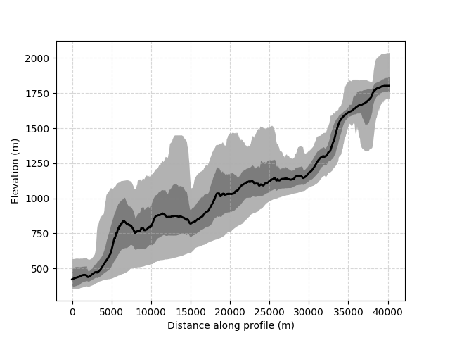
</div>


**Let's check a small binning distance to confirm**


```python
x_points, y_points = ttb.get_windowed_point_samples(dem, Dmap.centre_line_x,Dmap.centre_line_y,  405, half_width, binning_distance = 100, input_mode = "coordinates")
fig,ax = plt.subplots(figsize = (8,5))
im = ax.imshow(dem.z, extent = dem.extent, cmap = 'terrain')
ax.imshow(dem.hillshade(), extent = dem.extent, cmap = 'gray', alpha = 0.6)
ax.grid(ls='--',alpha=0.5)
ax.set_xlabel('Easting (m)')
ax.set_ylabel('Northing (m)')
ax.scatter(x_points, y_points, color = 'cyan', lw = 0, s =5)
ax.plot(Dmap.centre_line_x,Dmap.centre_line_y, lw =1, color = 'k')
ax.imshow(np.abs(distance_map.z), extent = dem.extent, cmap = 'magma', alpha = 0.8)
ax.set_title("Example of non-optimal sampling")
plt.colorbar(im, label = 'elevation (m)')
```


    <matplotlib.colorbar.Colorbar at 0x7f63e0722610>


<div style="display: inline-block;">
    <div class="jupyter-widgets widget-label" style="text-align: center;">
        Figure
    </div>
    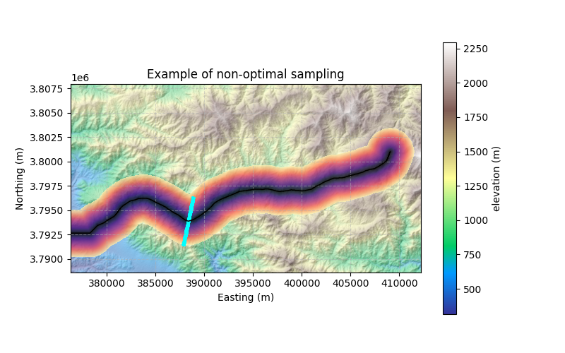
</div>


And we are done!

**I expect these tools to go live in the coming days/weeks**, I am finalising the details and then the PR will gothrough debugging processes.

Any comment, suggestion question: boris.gailleton@univ-rennes.fr


```python

```
